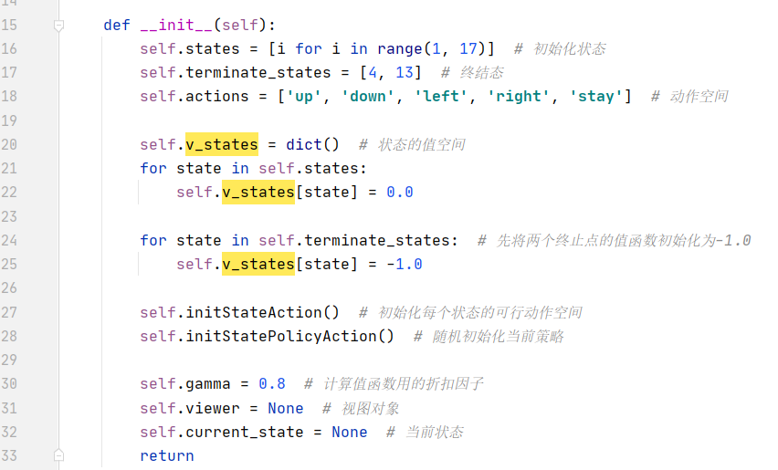
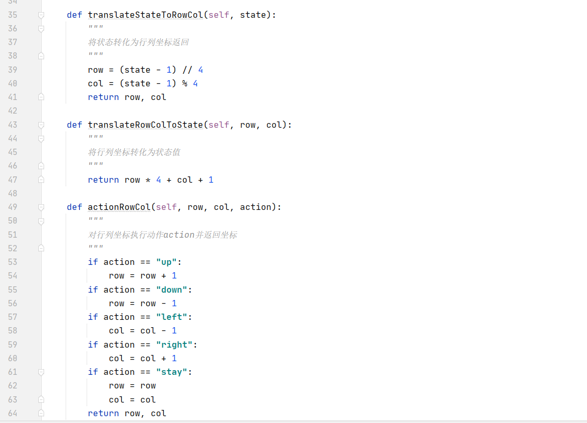
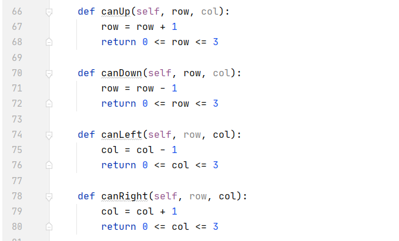
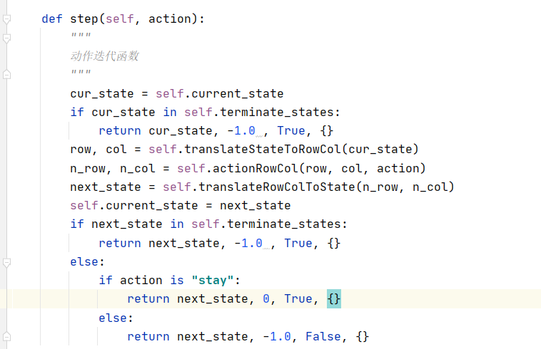

## 流程
------
### 总体设计

#### 参考资料

[策略迭代算法](https://blog.csdn.net/hold_on_me/article/details/81713173?utm_medium=distribute.pc_relevant.none-task-blog-2~default~BlogCommendFromMachineLearnPai2~default-4.control&depth_1-utm_source=distribute.pc_relevant.none-task-blog-2~default~BlogCommendFromMachineLearnPai2~default-4.control)

### 主要是根据参考资料的模型来更改的

ps：本算法的下标 是自下而上 自左向右的

+ 13 14 15 16
+ 9 10 11 12
+ 5  6  7  8
+ 1  2  3  4  

## PS：具体怎么注册就和上次的一样


我的思路是 4 13 的状态值为 -1.0

其余的所有状态值为 0.0



这部分是坐标转化的内容




每个状态对应可做的动作可以计算出来


除了 上下左右 我增加了 stay的动作（只要上下左右动作少了一个 那么他必有stay的动作）



+ 上下左右的动作的reward都是-1.0
+ stay的动作的reward是0.0

### 有关策略评估的部分我没有更改，可看参考资料

### 下述是环境代码
```python
import numpy as np
import random
from gym import spaces
import gym
from gym.envs.classic_control import rendering

#模拟迭代环境类
class StrategyEnv(gym.Env):
    # 相关的全局配置
    metadata = {
        'render.modes': ['human', 'rgb_array'],
        'video.frames_per_second': 2
    }

    def __init__(self):
        self.states = [i for i in range(1, 17)]  # 初始化状态
        self.terminate_states = [4, 13]  # 终结态
        self.actions = ['up', 'down', 'left', 'right', 'stay']  # 动作空间

        self.v_states = dict()  # 状态的值空间
        for state in self.states:
            self.v_states[state] = 0.0

        for state in self.terminate_states:  # 先将两个终止点的值函数初始化为-1.0
            self.v_states[state] = -1.0

        self.initStateAction()  # 初始化每个状态的可行动作空间
        self.initStatePolicyAction()  # 随机初始化当前策略

        self.gamma = 0.8  # 计算值函数用的折扣因子
        self.viewer = None  # 视图对象
        self.current_state = None  # 当前状态
        return

    def translateStateToRowCol(self, state):
        """
        将状态转化为行列坐标返回
        """
        row = (state - 1) // 4
        col = (state - 1) % 4
        return row, col

    def translateRowColToState(self, row, col):
        """
        将行列坐标转化为状态值
        """
        return row * 4 + col + 1

    def actionRowCol(self, row, col, action):
        """
        对行列坐标执行动作action并返回坐标
        """
        if action == "up":
            row = row + 1
        if action == "down":
            row = row - 1
        if action == "left":
            col = col - 1
        if action == "right":
            col = col + 1
        if action == "stay":
            row = row
            col = col
        return row, col

    def canUp(self, row, col):
        row = row + 1
        return 0 <= row <= 3

    def canDown(self, row, col):
        row = row - 1
        return 0 <= row <= 3

    def canLeft(self, row, col):
        col = col - 1
        return 0 <= col <= 3

    def canRight(self, row, col):
        col = col + 1
        return 0 <= col <= 3

    def initStateAction(self):
        """
        初始化每个状态可行动作空间
        """
        self.states_actions = dict()
        for state in self.states:
            self.states_actions[state] = []
            if state in self.terminate_states:
                continue
            row, col = self.translateStateToRowCol(state)
            if self.canUp(row, col):
                if self.translateRowColToState(row+1,col) in self.terminate_states:
                    if "stay" not in self.states_actions[state]:
                        self.states_actions[state].append("stay")
                else:
                    self.states_actions[state].append("up")
            else:
                if "stay" not in self.states_actions[state]:
                    self.states_actions[state].append("stay")

            if self.canDown(row, col):
                if self.translateRowColToState(row - 1 , col) in self.terminate_states:
                    if "stay" not in self.states_actions[state]:
                        self.states_actions[state].append("stay")
                else:
                    self.states_actions[state].append("down")
            else:
                if "stay" not in self.states_actions[state]:
                    self.states_actions[state].append("stay")

            if self.canLeft(row, col):
                if self.translateRowColToState(row, col-1) in self.terminate_states:
                    if "stay" not in self.states_actions[state]:
                        self.states_actions[state].append("stay")
                else:
                    self.states_actions[state].append("left")
            else:
                if "stay" not in self.states_actions[state]:
                    self.states_actions[state].append("stay")

            if self.canRight(row, col):
                if self.translateRowColToState(row, col + 1) in self.terminate_states:
                    if "stay" not in self.states_actions[state]:
                        self.states_actions[state].append("stay")
                else:
                    self.states_actions[state].append("right")
            else:
                if "stay" not in self.states_actions[state]:
                    self.states_actions[state].append("stay")
            print(state)
            print(self.states_actions[state])
        return

    def initStatePolicyAction(self):
        """
        初始化每个状态的当前策略动作
        """
        self.states_policy_action = dict()
        for state in self.states:
            if state in self.terminate_states:
                self.states_policy_action[state] = None
            else:
                self.states_policy_action[state] = random.sample(self.states_actions[state], 1)[0]
        return

    def seed(self, seed = None):
        random.seed(seed)
        return [seed]

    def reset(self):
        """
        重置原始状态
        """
        self.current_state = random.sample(self.states, 1)[0]

    def step(self, action):
        """
        动作迭代函数
        """
        cur_state = self.current_state
        if cur_state in self.terminate_states:
            return cur_state, -2.0 , True, {}
        row, col = self.translateStateToRowCol(cur_state)
        n_row, n_col = self.actionRowCol(row, col, action)
        next_state = self.translateRowColToState(n_row, n_col)
        self.current_state = next_state
        if next_state in self.terminate_states:
            return next_state, -2.0 , True, {}
        else:
            if action is "stay":
                return next_state, 0, True, {}
            else:
                return next_state, -1.0, False, {}

    def policy_evaluate(self):
        """
        策略评估过程
        """
        error = 0.000001  # 误差率
        for _ in range(1000):
            max_error = 0.0  # 初始化最大误差
            for state in self.states:
                if state in self.terminate_states:
                    continue
                action = self.states_policy_action[state]
                self.current_state = state
                next_state, reward, isTerminate, info = self.step(action)
                old_value = self.v_states[state]
                self.v_states[state] = reward + self.gamma * self.v_states[next_state]
                abs_error = abs(self.v_states[state] - old_value)
                max_error = abs_error if abs_error > max_error else max_error  # 更新最大值
            if max_error < error:
                break

    def policy_improve(self):
        """
        根据策略评估的结果，进行策略更新,并返回每个状态的当前策略是否发生了变化
        """
        changed = False
        for state in self.states:
            if state in self.terminate_states:
                continue
            max_value_action = self.states_actions[state][0]  # 当前最大值行为
            max_value = -1000000000000.0  # 当前最大回报
            for action in self.states_actions[state]:
                self.current_state = state
                next_state, reward, isTerminate, info = self.step(action)
                q_reward = reward + self.gamma * self.v_states[next_state]
                if q_reward > max_value:
                    max_value_action = action
                    max_value = q_reward
            if self.states_policy_action[state] != max_value_action:
                changed = True
            self.states_policy_action[state] = max_value_action
        return changed

    def createGrids(self):
        """
        创建网格
        """
        start_x = 40
        start_y = 40
        line_length = 40
        for state in self.states:
            row, col = self.translateStateToRowCol(state)
            x = start_x + col * line_length
            y = start_y + row * line_length
            line = rendering.Line((x, y), (x + line_length, y))
            line.set_color(0, 0, 0)
            self.viewer.add_onetime(line)
            line = rendering.Line((x, y), (x, y + line_length))
            line.set_color(0, 0, 0)
            self.viewer.add_onetime(line)
            line = rendering.Line((x + line_length, y), (x + line_length, y + line_length))
            line.set_color(0, 0, 0)
            self.viewer.add_onetime(line)
            line = rendering.Line((x, y + line_length), (x + line_length, y + line_length))
            line.set_color(0, 0, 0)
            self.viewer.add_onetime(line)

    def createTraps(self):
        """
        创建两个不可到点
        """
        start_x = 40
        start_y = 40
        line_length = 40
        for state in self.terminate_states:
            row, col = self.translateStateToRowCol(state)
            trap = rendering.make_circle(20)
            trans = rendering.Transform()
            trap.add_attr(trans)
            trap.set_color(0, 0, 0)
            trans.set_translation(start_x + line_length * col + 20, start_y + line_length * row + 20)
            self.viewer.add_onetime(trap)

    def createRobot(self):
        """
        创建机器人
        """
        start_x = 40
        start_y = 40
        line_length = 40
        row, col = self.translateStateToRowCol(self.current_state)
        robot = rendering.make_circle(15)
        trans = rendering.Transform()
        robot.add_attr(trans)
        robot.set_color(1, 0, 1)
        trans.set_translation(start_x + line_length * col + 20, start_y + line_length * row + 20)
        self.viewer.add_onetime(robot)

    def render(self, mode="human", close=False):
        """
        渲染整个场景
        """
        # 关闭视图
        if close:
            if self.viewer is not None:
                self.viewer.close()
                self.viewer = None

        # 视图的大小
        screen_width = 320
        screen_height = 320

        if self.viewer is None:
            self.viewer = rendering.Viewer(screen_width, screen_height)

        # 创建网格
        self.createGrids()
        # 创建陷阱
        self.createTraps()
        # 创建机器人
        self.createRobot()
        return self.viewer.render(return_rgb_array=mode == 'rgb_array')


```