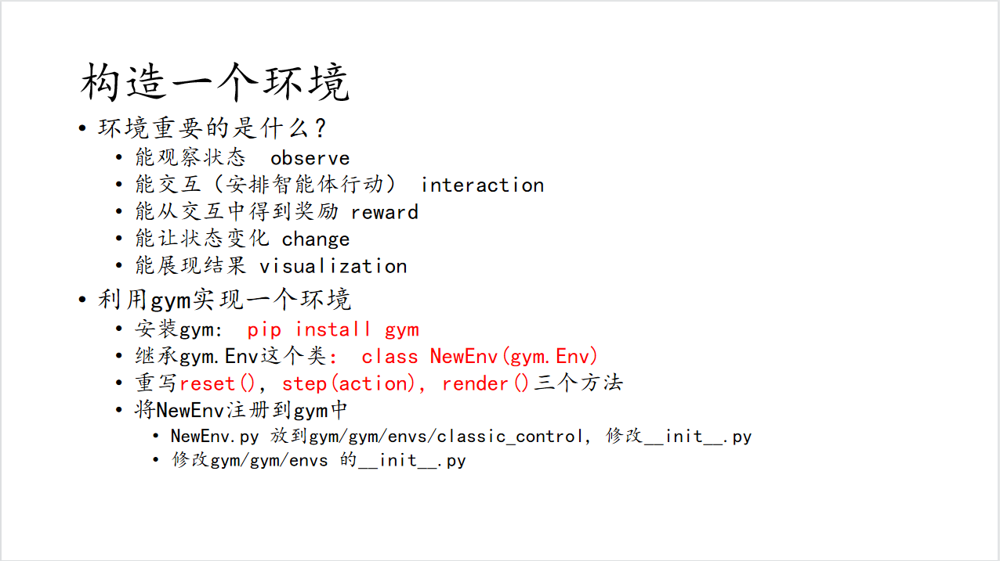
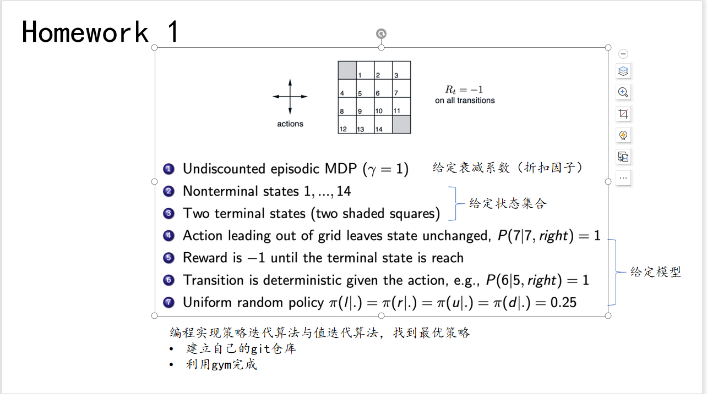
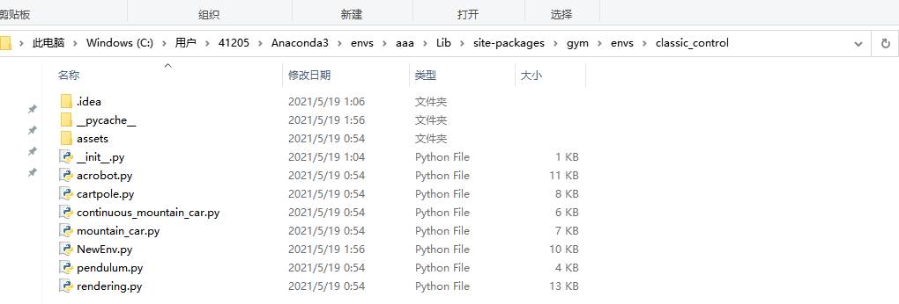
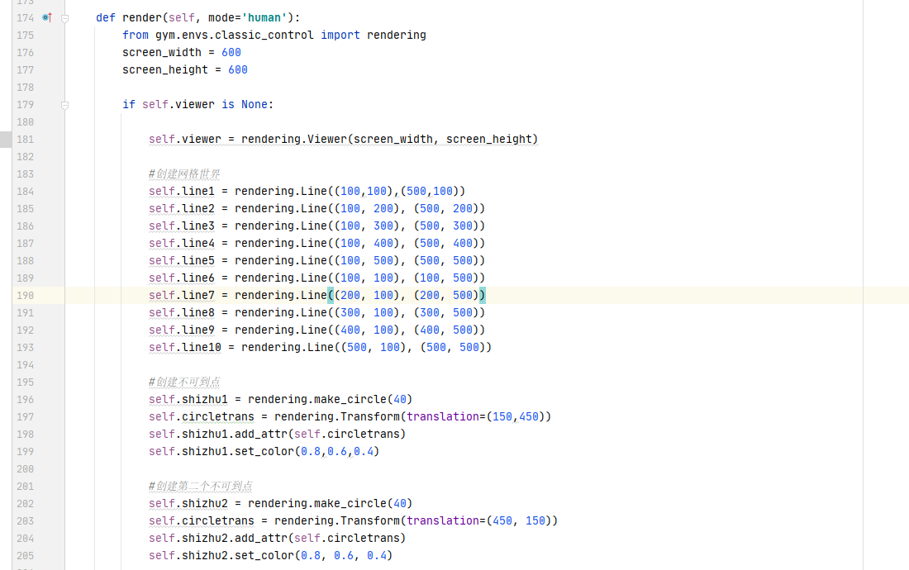
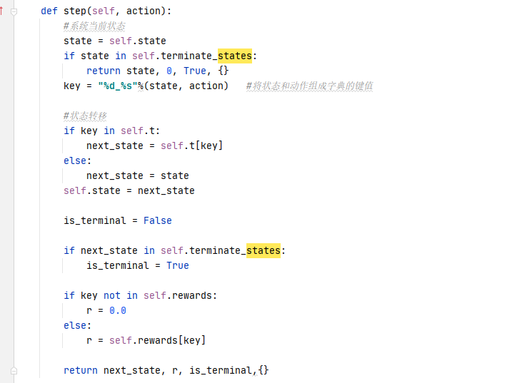
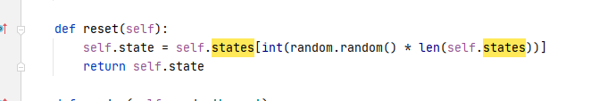
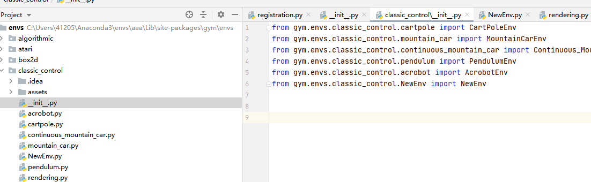
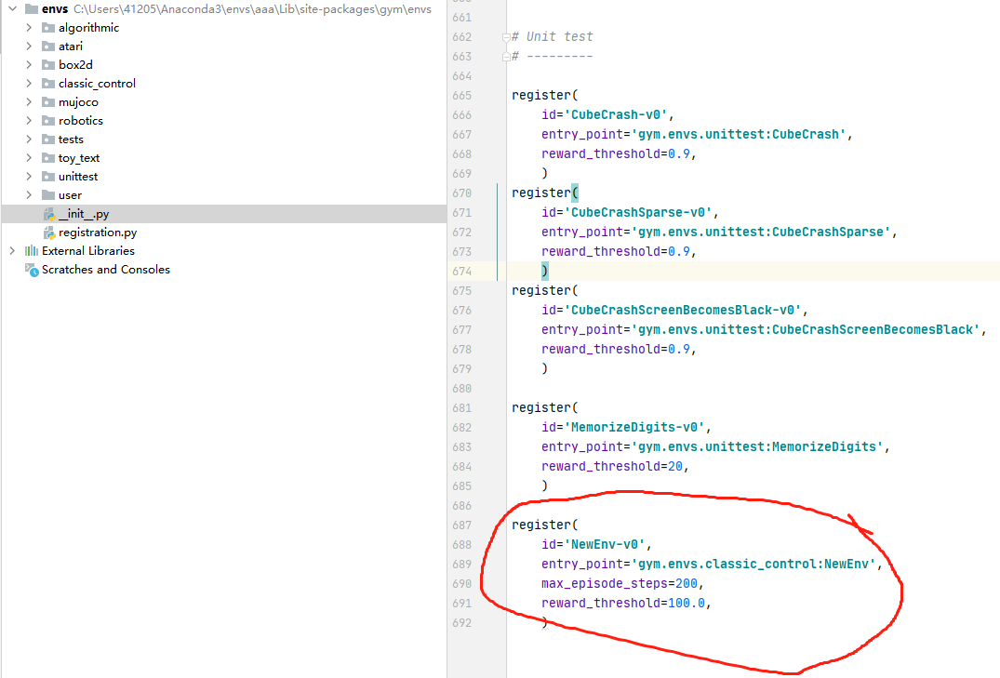

## 强化学习 gym环境搭建
---

### 一、任务清单

### 二、参考文献

  + [<深入浅出强化学习 原理入门>读书笔记（1）](https://blog.csdn.net/kuizhao8951/article/details/97009850)
  +  [OpenAI Gym构建自定义强化学习环境](https://blog.csdn.net/extremebingo/article/details/80867486)

### 三、环境搭建

+ 首先新建环境配置是 python3.7
    + 利用anaconda 或 命令行输入 conda create --name aaa python=3.7
+ pip install gym
+ 进入生成环境下的 

+ 新建NewEnv.py文件（具体内容 重写函数等等）
    + render
    + 

    + step
    + 
    
    + reset
    + 

+ 同时在本文件夹下的__init__.py中加入import NewEnv 使外部能够调用

+ 回到上一级文件夹 ，在envs的文件夹中的__init__.py中应当注册一个环境

+ 然后最终写一个.py文件用于import gym  生成环境 进行调用

### ps：认为最坑的地方就是在envs中注册环境的时候 id必须加上后缀“-V0”